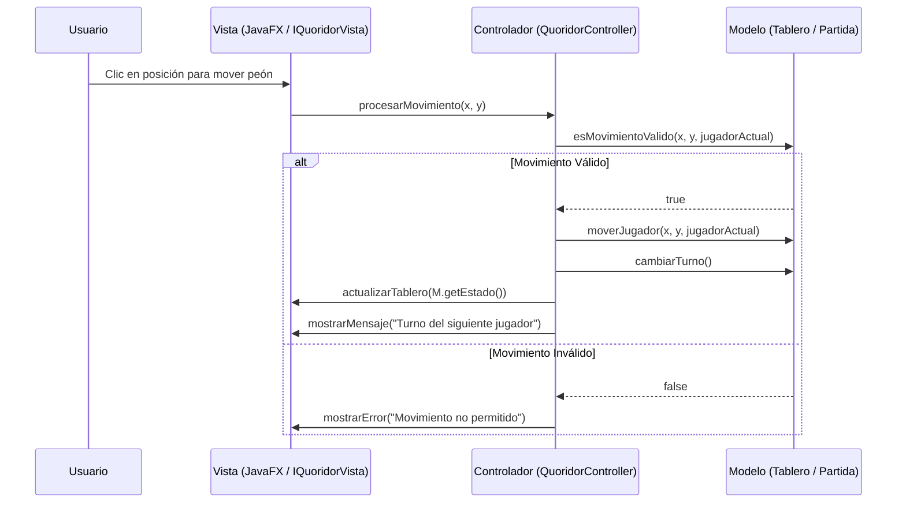

# 01. Arquitectura Global de Quoridor

## 1. Arquitectura Modelo-Vista-Controlador (MVC)
El proyecto implementará el patrón arquitectónico Modelo-Vista-Controlador (MVC) de manera estricta para asegurar la máxima cohesión y el mínimo acoplamiento, facilitando las pruebas unitarias y de integración.

- **Modelo**: Contiene toda la lógica de negocio, las reglas del juego de Quoridor y el estado actual de la partida. No tiene ninguna dependencia de la Vista ni del Controlador.
- **Vista**: Es totalmente pasiva (Passive View). Su única responsabilidad es renderizar el estado del juego que le proporciona el Controlador y capturar las interacciones del usuario (clics en tablero, botones) para notificarlas al Controlador. Se implementará con JavaFX.
- **Controlador**: Actúa como intermediario. Recibe los eventos de la Vista, invoca los métodos correspondientes en el Modelo para procesar las jugadas, y actualiza la Vista con el nuevo estado.

## 2. Gestión de Muros y Casillas
El tablero de Quoridor consta de una cuadrícula de 9x9 casillas para el movimiento de los peones y un entramado intermedio para la colocación de muros.

Para gestionar este estado, el dominio empleará una estructura basada en coordenadas para la posición de los jugadores y listas independientes de objetos `Muro`.

**Características de este diseño**:
- **Facilita el *Data-driven testing***: Se pueden inyectar fácilmente conjuntos de coordenadas para muros mediante `@MethodSource` o `@CsvSource` en pruebas parametrizadas.
- **Valores Límite**: Comprobar muros en los bordes del tablero es directo al poder evaluar trivialmente las coordenadas X e Y.
- **Semántica y Memoria**: El tablero inicia sin muros. Almacenar únicamente los muros que se han colocado (`List<Muro>`) representa el estado real del dominio de forma natural.
- **Desacoplamiento**: Permite separar la lógica de bloqueo de caminos de la simple ubicación del jugador en las casillas.

## 3. Diagrama de Interacción Conceptual

